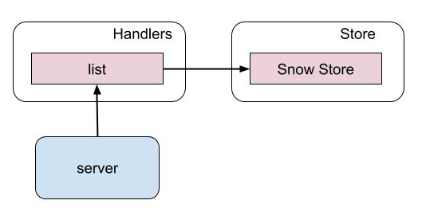

# server
This web service serves `incidents` details by exposing apis.

## Setup
```
$ git clone git@github.intuit.com:SHAKIRA/server.git
$ cd server
$ make
>> checking code style
>> building binaries
env CGO_ENABLED=0 GOOS=linux GOARCH= go build -a -installsuffix cgo -o /Users/shakira/go/src/server/bin//server .
>> running all tests
go test -race -v -coverprofile=coverage.txt -covermode=atomic  ./...
?       server  [no test files]
=== RUN   TestHttpHandler
--- PASS: TestHttpHandler (0.00s)
=== RUN   TestRequestLogger
time="2019-09-03T11:18:19-07:00" level=info msg="GET\t/\t127.0.0.1:63037\t19.828µs"
--- PASS: TestRequestLogger (0.00s)
PASS
coverage: 100.0% of statements
ok      server/handlers 1.354s  coverage: 100.0% of statements
?       server/store    [no test files]
=== RUN   TestInit
--- PASS: TestInit (0.00s)
=== RUN   TestGetList
--- PASS: TestGetList (0.00s)
PASS
coverage: 92.3% of statements
ok      server/store/snow       1.040s  coverage: 92.3% of statements
>> Uploading to codecov
>> skipping due to env

$ make docker
docker build -t "msaas/pasi/server/service/msaas/pasi/server/service/server-linux-amd64:master" \
                --build-arg ARCH="amd64" \
                --build-arg OS="linux" \
                ./
Sending build context to Docker daemon   8.07MB
Step 1/6 : FROM scratch
 ---> 
Step 2/6 : ADD server.crt /
 ---> Using cache
 ---> fac3f14adce3
Step 3/6 : ADD server.key /
 ---> Using cache
 ---> 40088f3f7abd
Step 4/6 : ADD incidents.json /
 ---> Using cache
 ---> 7885aefa96ff
Step 5/6 : ADD bin/server /
 ---> Using cache
 ---> fb8ab83a54db
Step 6/6 : CMD ["/server"]
 ---> Using cache
 ---> 2878bda03ad1
[Warning] One or more build-args [ARCH OS] were not consumed
Successfully built 2878bda03ad1
Successfully tagged msaas/pasi/server/service/msaas/pasi/server/service/server-linux-amd64:master

$ make run
>> running docker image
docker run --publish 443:443 -it msaas/pasi/server/service/msaas/pasi/server/service/server-linux-amd64:master
INFO[02-09-2019 00:21:23] Server starting...                           
INFO[02-09-2019 00:21:23] Initializing serviceNow store 
```

## Design


## Tests
Unit tests and integration tests are added.
```
- make test
```

### Benchmarking
```
handlers@shakira$  go test -bench=.
goos: darwin
goarch: amd64
pkg: server/handlers
BenchmarkHandler_ListHandler/200_incs-8                    10000            223764 ns/op
BenchmarkHandler_ListHandler/6_incs-8                    1000000              1447 ns/op
BenchmarkHandler_ListHandler/50_incs-8                     10000            114916 ns/op
BenchmarkHandler_ListHandler/100_incs-8                     5000            221922 ns/op
```
